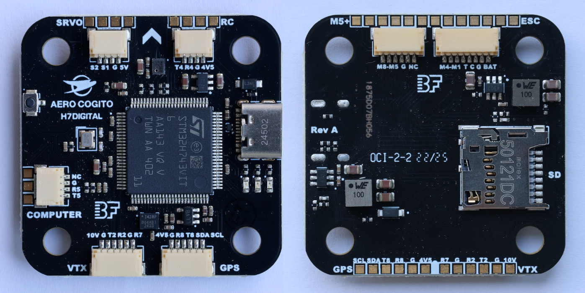

# AeroCogito H7 Digital Flight Controller

[](../../releases/latest)
[](../../actions)
[](LICENSE)
[](SECURITY.md)
[](SECURITY.md)

Secure, NDAA / Blue UAS compliant ArduPilot firmware for the [**AeroCogito H7 Digital Flight Controller**](https://aerocogito.com/store/p/h7-digital)



## 🚁 Hardware Overview

**STM32H743-based flight controller** designed for professional UAS applications requiring high performance and **secure, compliant firmware**.
- Full ArduPilot/BetaFlight compatibility
- [Hardware specifications & purchase info](https://aerocogito.com/store/p/h7-digital)

## 🔐 Security & Compliance

- **Secure Boot:** Ed25519 signed firmware with hardware bootloader verification
- **NDAA & Blue UAS Compliant:** Meets **NDAA Section 848 Operating Software** compliance and **DIU Blue UAS Framework** requirements
- **Built from Source:** Complete transparency with automated builds from official ArduPilot releases
- **Cryptographic Verification:** SHA-256 and SHA-512 checksums for all releases
- **🇺🇸 Made in the USA:** Hardware and firmware pipeline designed and maintained in the United States

[Full compliance details in SECURITY.md](SECURITY.md)

## 📦 Downloads

Get the latest signed firmware from [Releases](../../releases/latest)

### File Types

| File | Purpose |
|------|---------|
| `*-signed.apj` | Firmware updates (requires secure bootloader already installed) |
| `*-with-bootloader-signed.hex` | Complete system (secure bootloader + signed firmware for new installations) |

## 🚀 Quick Start

### Option A: Standard Firmware Update (Already Have Bootloader)

1. Download `arducopter-*-signed.apj` from [Releases](../../releases/latest)
2. Verify SHA-256/512 checksum
3. Mission Planner → Setup → Install Firmware → Load custom firmware
4. Select downloaded `.apj` file

### Option B: Fresh Installation or Recovery (DFU Mode Required)

1. Download `arducopter-*-with-bootloader-signed.hex` from [Releases](../../releases/latest)
2. Verify SHA-256/512 checksum
3. Put board in DFU mode (hold BOOT button while connecting USB)
4. Flash using STM32CubeProgrammer or Betaflight Configurator
5. Power cycle board

See release notes for detailed instructions.

## 🔑 Public Key

Firmware signing public key: [`keys/AeroCogito_public_key.dat`](keys/AeroCogito_public_key.dat)

Public key fingerprint: [`keys/FINGERPRINT.txt`](/keys/FINGERPRINT.txt):
```bash
e3:37:0c:eb:9f:e4:78:de:fd:82:ba:a7:79:8c:4e:dc:95:be:3e:3b:95:fd:ca:ac:07:06:22:f2:f6:1b:16:91
```

The secure bootloader contains this key and only boots signed firmware.

## ✅ Verify Firmware Authenticity

**Before installing, always verify checksums:**
```bash
# Linux/macOS
sha256sum -c arducopter-*-SHA256SUMS.txt

# Expected output: arducopter-*-signed.apj: OK
```
```powershell
# Windows PowerShell
Get-FileHash arducopter-*-signed.apj -Algorithm SHA256

# Compare with SHA256SUMS.txt
```

## 📋 Repository Contents

```
├── .github/
│   ├── CODEOWNERS                          # Code ownership and review requirements
│   └── workflows/
│       ├── build-signed-firmware.yml       # Main build pipeline
│       └── check-ardupilot-releases.yml    # Auto-detect new ArduPilot releases
├── docs/
│   └── images/
│       └── H7-Digital_pinout.jpg           # Hardware pinout diagram
├── keys/
│   ├── AeroCogito_public_key.dat           # Firmware signing public key
│   └── FINGERPRINT.txt                     # Key fingerprint for verification
├── .gitignore                              # Git ignore rules
├── LICENSE                                 # GPLv3 license
├── README.md                               # This file
└── SECURITY.md                             # Security policy & compliance details
```

## 🏗️ Build Process

Automated builds run daily at UTC midnight, checking for new ArduPilot releases:

1. Clone official ArduPilot repository at tagged release
2. Build from source for AeroCogito-H7Digital board
3. Sign firmware with private key (stored as GitHub Secret)
4. Generate cryptographic checksums
5. Create GitHub release

View build logs: [Actions](../../actions)

## 📚 Documentation

- **Installation Guide:** See individual release notes
- **Security Policy:** [SECURITY.md](SECURITY.md)
- **ArduPilot Documentation:** https://ardupilot.org/copter/

## 🆘 Support

- **Email:** support@aerocogito.com
- **Security:** security@aerocogito.com (for vulnerabilities and compliance auditing)

## ⚖️ License

This project follows ArduPilot's GPL-3.0 license.

Firmware is based on [ArduPilot](https://github.com/ArduPilot/ardupilot) © ArduPilot Dev Team.