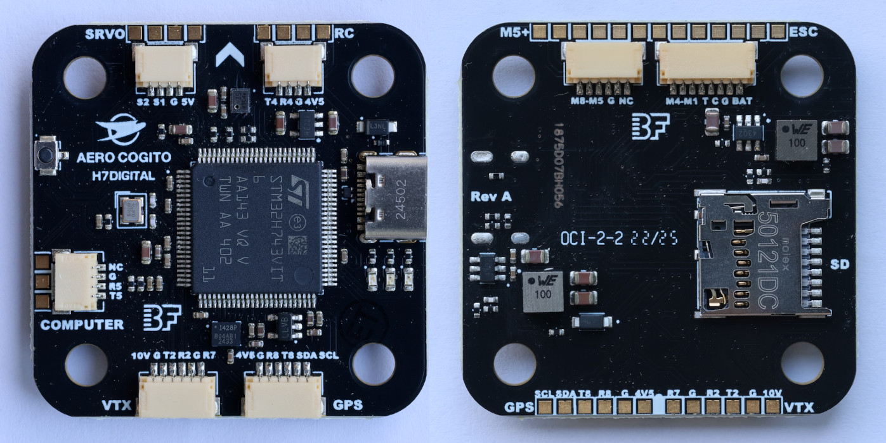

# AeroCogito H7 Digital Flight Controller

Secure, NDAA / Blue UAS compliant ArduPilot firmware for the AeroCogito H7 Digital Flight Controller.



## 🔐 Security & Compliance

- **Secure Boot:** Ed25519 signed firmware with hardware bootloader verification
- **NDAA & Blue UAS Compliant:** Meets **NDAA Section 848 Operating Software** compliance and **DIU Blue UAS Framework** requirements
- **Built from Source:** Complete transparency with automated builds from official ArduPilot releases
- **Cryptographic Verification:** SHA-256 and SHA-512 checksums for all releases

## 📦 Downloads

Get the latest signed firmware from [Releases](../../releases/latest)

### File Types

| File | Purpose |
|------|---------|
| `*-signed.apj` | Firmware updates (requires secure bootloader already installed) |
| `*-with-bootloader-signed.hex` | Complete system (secure bootloader + signed firmware for new installations) |

## 🚀 Quick Start

### Standard Firmware Update

1. Download `arducopter-*-signed.apj` from [Releases](../../releases/latest)
2. Verify SHA-256/512 checksum
3. Mission Planner → Setup → Install Firmware → Load custom firmware
4. Select downloaded `.apj` file

### Fresh Installation (DFU Mode)

1. Download `arducopter-*-with-bootloader-signed.hex` from [Releases](../../releases/latest)
2. Verify SHA-256/512 checksum
3. Put board in DFU mode (hold BOOT button while connecting USB)
4. Flash using STM32CubeProgrammer or Betaflight Configurator
5. Power cycle board

See release notes for detailed instructions.

## 🔑 Public Key

Firmware signing public key: [`keys/AeroCogito_public_key.dat`](keys/AeroCogito_public_key.dat)

The secure bootloader contains this key and only boots signed firmware.

## 📋 Repository Contents

```
├── .github/workflows/      # Automated build pipeline
├── keys/                   # Public signing key with fingerprint
├── SECURITY.md             # Security policy and vulnerability reporting
└── LICENSE                 # GPLv3 derived from ArduPilot
```

## 🏗️ Build Process

Automated builds run daily at UTC midnight, checking for new ArduPilot releases:

1. Clone official ArduPilot repository at tagged release
2. Build from source for AeroCogito-H7Digital board
3. Sign firmware with private key (stored as GitHub Secret)
4. Generate cryptographic checksums
5. Create GitHub release

View build logs: [Actions](../../actions)

## 📚 Documentation

- **Installation Guide:** See individual release notes
- **Security Policy:** [SECURITY.md](SECURITY.md)
- **ArduPilot Documentation:** https://ardupilot.org/copter/

## 🆘 Support

- **Email:** support@aerocogito.com
- **Security:** security@aerocogito.com (for vulnerabilities and compliance auditing)

## ⚖️ License

This project follows ArduPilot's GPL-3.0 license.

Firmware is based on [ArduPilot](https://github.com/ArduPilot/ardupilot) © ArduPilot Dev Team.

---

**Made in the USA** 🇺🇸